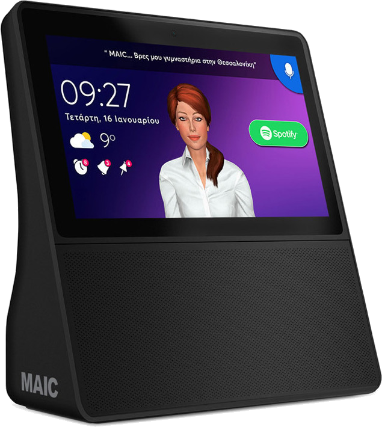
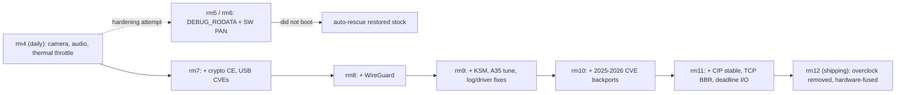
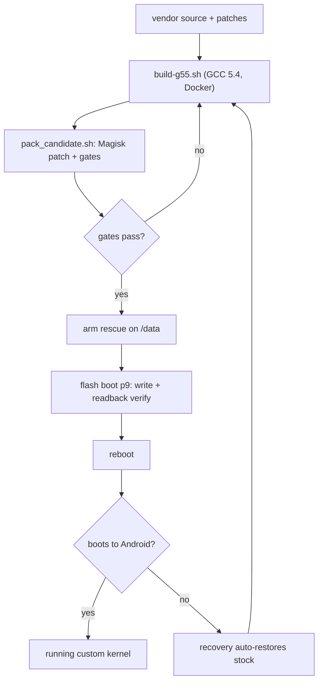

# MAIC: a custom kernel and rooted Android for the MLS MAIC smart hub

Turning an **MLS MAIC** (`iQR70`) desktop hub, from the defunct Greek maker MLS
Innovation, into a fully rooted, hardened, custom-kernel Android tablet. It runs
streaming TV and doubles as a small always-on home server.

<p align="center"></p>

The MAIC is a locked-down MediaTek smart display for a company that no longer
exists. There are no firmware updates, no published kernel source, and no Google
services. The goal is to own it completely: root it for good, strip the bloat, fix
what MLS left broken, and replace the frozen stock kernel with a maintained,
hardened build. All of it cable-free, and above all **without ever bricking it**.

📝 **Full writeup:** [My mini kitchen TV runs Docker now](https://medium.com/@mloukeris/my-mini-kitchen-tv-runs-docker-now-5dffad481fa7), on Medium.

## Table of contents

- [Device](#device)
- [Part 1: Root and userspace](#part-1-root-and-userspace)
  - [Permanent root and recovery](#permanent-root-and-recovery)
  - [Debloat](#debloat)
  - [TLS and ad-blocking](#tls-and-ad-blocking)
  - [UI fixes](#ui-fixes)
  - [Access](#access)
- [Part 2: The custom kernel](#part-2-the-custom-kernel)
  - [What we built and how it went](#what-we-built-and-how-it-went)
  - [Kernel features](#kernel-features)
  - [Docker](#docker)
  - [Building the kernel](#building-the-kernel)
  - [The auto-rescue](#the-auto-rescue)
- [Repository layout](#repository-layout)
- [Known limitations](#known-limitations)
- [Disclaimer](#disclaimer)

## Device

| | |
|---|---|
| Model / board | MLS MAIC (`iQR70`), ODM Emdoor |
| SoC | MediaTek **MT8167**, quad Cortex-A35 |
| GPU | IMG **PowerVR GE8300** (Rogue), not Mali |
| RAM / storage | 2 GB, 7.3 GB eMMC (about 3.3 GB userdata) |
| OS | Android **7.0** (`IQR70_V5.0`), SELinux enforcing |
| Ports | 1x USB-A host, 3.5 mm, DC barrel (mains powered) |

---

## Part 1: Root and userspace

What you need to run the MAIC as a daily rooted device: permanent root, the
certificate fix that makes HTTPS work again, debloat, and the UI repairs. All of it
works on the stock kernel.

### Permanent root and recovery

- **Magisk 30.7** patched boot on `mmcblk0p9`, survives reboots. This legacy image ships
  `skip_initramfs`, which modern Magisk's init does not expect; the boot repack rewrites it
  to `want_initramfs` (a 4-byte patch), so current Magisk patches and boots it cleanly.
- **Cable-free recovery.** MediaTek's `mtk-su` kernel exploit grants temp root over
  plain wireless ADB no matter what state Magisk is in. A bad root patch is always
  fixable without a USB-A-to-A cable or BROM.

### Debloat

Removed MLS, Emdoor (the ODM), and unused MediaTek packages: the history and
global-action apps, the engineer, ATCI and SIM services (there is no radio at all),
and the redundant music and recorder apps. System packages went from 51 to 42, and
every removal is reversible with `cmd package install-existing`.

### TLS and ad-blocking

- The ROM shipped without Let's Encrypt's roots, so every HTTPS stream failed.
  **ISRG Root X1 and X2** are injected into the system trust store on boot, which
  brought back TV, browser and F-Droid.
- The cert overlay is a bind-mount, not a Magisk module (a module corrupts file
  attributes here on every boot). It enforces `0644 root:root` and the right SELinux
  context on all 150 certs each boot.
- **Ad-blocking** runs through AdAway in systemless mode plus Pi-hole on the LAN.

### UI fixes

- **Status bar restored.** MLS had zeroed `status_bar_height` (`0dp`) in the framework, so
  SystemUI drew a zero-height bar. Rather than re-sign the whole `framework-res.apk` (which
  boots under Magisk 25.2 but hangs under Magisk 27+, whose overlayfs magic-mount wedges the
  zygote-mmapped framework), a **Runtime Resource Overlay** (`magisk-modules/statusbar-rro`)
  overrides it to `24dp`: a ~3.4 KB `/vendor/overlay` APK the ROM's `idmap` pairs at boot,
  so the clock, icons and pull-down shade work and it stays mount-safe under any Magisk.
- **Night screen.** The always-on daydream clock kept the panel lit around the clock.
  A schedule darkens it overnight and runs a nightly `fstrim`, which reclaimed 1.14 GB
  on its first pass.

### Access

- **ADB** over Wi-Fi and **SSH** (SimpleSSHD, key auth), both auto-enabled on boot.
  Root is permanent. If it ever breaks, `mtk-su` restores it over wireless ADB.

---

## Part 2: The custom kernel

The stock 4.4.22 was a dead end, so this rebuilds the kernel from the vendor base and
adds real capabilities. The shipping build is **`maic-4.4.302-cip114`** (rm12), built with
GCC 5.4 and tuned for the Cortex-A35 (`-mtune=cortex-a35`).

### What we built and how it went

- **Bumped to Linux 4.4.302** and fixed the hardware along the way: the front camera
  (GC5024 MIPI settle timing plus a mirror), the speaker (Emdoor DSP, I2S, and an AFE
  SRAM `memset_io` fault), and touch and USB-host parity.
- **It bit back, and the safety net held.** Two hardening builds (rm5 and rm6) turned
  on `DEBUG_RODATA` and software PAN, which fault on this A35 vendor kernel and never
  boot. The [auto-rescue](#the-auto-rescue) caught both, restored stock from recovery
  on its own, and the device never bricked. The shipping kernel drops those two
  options and keeps everything else.
- **Then the good builds.** rm7 added hardware crypto and the USB security fixes, and
  rm8 added in-kernel WireGuard. Each was flashed supervised with the rescue armed.
- **rm9: memory and polish.** Added `KSM` (kernel samepage merging) to dedup
  RAM across the Docker containers and app set on this 2 GB device, plus A35
  instruction-scheduling tuning. It also carries a set of log-and-driver clean-ups found
  by auditing the boot log: guarding the camera driver's vestigial GPIO requests (which
  removed 8 boot-time `WARN` backtraces), demoting a once-a-second charger status line
  that was flooding and evicting the kernel ring buffer, and splitting a DPI pin out of a
  drive-strength group so the panel pinctrl applies cleanly instead of failing and
  reverting.
- **rm10: a security refresh.** Backported five upstream CVE fixes, each
  hand-verified against this 4.4 tree: HID `s32ton` hardening (CVE-2025-38556), an ipv4
  source-route capability check (CVE-2026-53249), a `zap_other_threads` signal fix
  (CVE-2026-53352), ext4 extent-index bounds validation (CVE-2026-31449), and a conntrack
  invalid-RST fix (CVE-2026-63913). Two of the five applied cleanly, three were adapted by
  hand where the vendor tree had diverged, and a sixth candidate (a fcntl fasync locking
  swap) was left out on purpose because the vendor signal path was too different to port
  safely. exFAT was already on the modern in-tree driver, so it needed nothing.
- **rm11: CIP stable continuation, TCP BBR, and an I/O scheduler default.**
  Merged `linux-4.4.y-cip` (see `kernel-project/patches/backport/resolve-stage-cip114.sh`
  and `logs/stage-cip114.md`) -- ~2700 files brought to CIP's maintained stable
  continuation of 4.4 (upstream itself stopped at .302), covering `ext4`, `net/ipv4`,
  `ipv6`, `netfilter`, `core`, `sched`, `mm`, `crypto` and the USB-ethernet drivers with
  real use-after-free/out-of-bounds/leak/race fixes; two of rm10's five hand-picked
  CVEs turned out to be exactly CIP's own fix, retired as redundant. Backported
  **TCP BBR** (`kernel-project/patches/bbr/`) -- upstream added it in 4.9, so this is a
  real 7-commit adaptation onto a kernel two years older than the code, not a config
  flip. Set `deadline` as the default I/O scheduler (was `cfq`, tuned for spinning
  disks, wrong for eMMC). Also fixed a backlight-PWM/capacitive-touch interference bug
  (`kernel-project/patches/touch-pwm/`) traced to the panel's LED driver running
  slightly over its own datasheet's maximum PWM frequency -- and has since the factory.
- **rm12 (current): the overclock removed.** The 1400/1500 MHz CPU and 494 MHz GPU
  operating points never ran faster than stock. The kernel's frequency readings said
  1500 MHz, but the SoC's own frequency meter and benchmarks showed the MT8167B holding
  its fused 1.3 GHz / 400 MHz bin in the PLL hardware, whether the PLL was programmed
  through its register or through the frequency-hopping controller. The overclock code,
  its ceiling knob and the PTP resync hook are gone. The thermal-throttle fix stays,
  because it fixes a vendor bug at stock clocks too. Full write-up in
  [`BENCHMARKS.md`](BENCHMARKS.md#overclocking-not-possible-on-this-chip-cpu-or-gpu).



### Kernel features

| Area | Feature |
|---|---|
| Camera | GC5024 MIPI settle fix (`14` to `85`) plus horizontal mirror, so the front camera captures |
| Audio | Emdoor Synaptics DSP (CX2092x), AFE external amp and I2S, plus an AFE SRAM `memset_io` fix |
| CPU | Interactive governor over the stock **598 to 1300 MHz** range, and a thermal throttle that actually lowers the frequency (`kernel-project/patches/thermal/`). No overclock: the MT8167B enforces its fused 1.3 GHz CPU / 400 MHz GPU bin in hardware ([details](BENCHMARKS.md#overclocking-not-possible-on-this-chip-cpu-or-gpu)) |
| Crypto | ARMv8 Crypto Extensions (AES, GHASH/PMULL, SHA-1, SHA-2) for hardware dm-crypt, TLS and WireGuard |
| VPN | **WireGuard** in-kernel, backported via `wireguard-linux-compat` |
| Security | The CIP stable continuation of 4.4 (`ext4`, `net`, `mm`, `crypto`, USB-ethernet -- ~2700 files of maintained backports superseding most of the CVE list below) plus the original hand-picked set (CVE-2024-53104 uvcvideo, CVE-2024-50302 HID, CVE-2024-53197 usb-audio, CVE-2025-38556 HID `s32ton`, CVE-2026-53249 ipv4 source-route, CVE-2026-53352 signal, CVE-2026-31449 ext4 extents, CVE-2026-63913 conntrack), plus stack protector and `dmesg_restrict` |
| Filesystems | exFAT, NTFS, ext4, f2fs, vfat and iso9660 built in |
| Network | **TCP BBR** congestion control + `fq` pacer (see `kernel-project/patches/bbr/`), `fq_codel` used to be the default qdisc, now `fq` for BBR |
| Container | overlayfs and full cgroup and namespace support for Docker |
| Memory | `KSM` samepage merging (RAM dedup across containers and apps), zram with the `lz4` compressor, and tuned `dirty_ratio`, `page-cluster` and `extra_free_kbytes` for the 2 GB target |
| Storage | `deadline` I/O scheduler as the default (was `cfq`, tuned for rotational disks; eMMC is not one) |
| Build | GCC 5.4 with `-mtune=cortex-a35` (in-order-pipeline scheduling for this CPU) |
| Fixes | camera-driver GPIO `WARN` guard, charger status-line log-spam demoted, DPI panel pin-35 drive-strength split, and gslX680 touch coordinate calibration (`cal_*`) |

Left out on purpose: `DEBUG_RODATA` and `ARM64_SW_TTBR0_PAN` (they do not boot on this
SoC), KASLR (no bootloader entropy), and anything that bumps the GPU DDK or the
Wi-Fi/BT firmware ABI (those are blob-locked).

### Docker

The stock kernel could not run Docker, since it had no overlayfs, cgroups or
namespaces. The custom kernel adds all three, so real Docker runs on-device with
three Android-host workarounds: a private-namespace `/run` and resolv overlay, a CA
bundle built from the system trust store, and `DOCKER_RAMDISK`. It starts
automatically on boot.

### Building the kernel

The build is containerized so the toolchain is reproducible. The kernel source is the
vendor Emdoor/MT8167 4.4.22 tree plus the changes in `patches/`.

1. **Toolchain image.** GCC 5.4 (Ubuntu 16.04 `gcc-5-aarch64-linux-gnu`):
   ```sh
   docker build -t maic-kbuild-gcc5 kernel-project/docker-gcc5/
   ```
2. **Compile.** `build-g55.sh` seeds `.config` from the previous output, runs
   `olddefconfig`, then builds the `Image`:
   ```sh
   OUT=out_rm8 ./kernel-project/build-g55.sh
   ```
3. **Package** into a flashable boot image. This reapplies the Magisk
   `skip_initramfs` to `want_initramfs` kernel patch, packs with `mkboot.py`, and
   refuses to emit a candidate unless every gate passes (version string, device
   drivers present, ramdisk under the 4 MiB ceiling):
   ```sh
   OUTDIR=out_rm8 ./kernel-project/patches/backport/tools/pack_candidate.sh \
     <kernel-tree> maic-4.4.302-rm8 4.4.302
   ```
4. **Flash** the resulting `boot_*.img` to `boot` (`p9`). Arm the rescue, write, read
   back, and verify the checksum before rebooting. If it does not boot, recovery
   restores stock on its own.



### The auto-rescue

`p9` (boot) used to be a one-way door. A roughly 5 KB freestanding binary in the
recovery ramdisk restores a known-good boot image, pre-armed on `/data`, whenever the
device is booted into recovery. It validates the image (16 MiB, `ANDROID!` magic,
`ROOTFS` not `RECOVERY`), writes it, reads it back and verifies, and refuses on any
mismatch. It fired for real when rm5 and rm6 failed and brought the device back on its
own. The rescue target is always the stock kernel.

> **Never** write `preloader`, `lk`, or `nvram`. That is how these MediaTek boards
> hard-brick. Everything here stays on `boot` (`p9`) and `recovery` (`p10`).

## Measured results

Kernel changes (CIP, BBR, deadline I/O, the qdisc fix) are backed by actual
measurements on the device, not just reasoning -- see [`BENCHMARKS.md`](BENCHMARKS.md),
including the real bugs the measuring process itself uncovered (a config change silently
reverted every boot, and a qdisc sysctl that did nothing on the Wi-Fi interface). It also
documents why there is no overclock: an earlier 1500 MHz overclock reported success
everywhere in software, but the SoC's own frequency meter showed the chip holding its
fused 1.3 GHz bin in hardware, so it was removed in `rm12`.

## Repository layout

```
kernel-project/   custom-kernel build harness, patches, packaging (mkboot.py) and notes
  patches/        the kernel changes: crypto, USB CVEs, WireGuard, tuning, thermal
                  throttle, CIP stable backport, TCP BBR, backlight-PWM touch fix
  build-*.sh      GCC 5.4 and GCC 4.9 dockerized builds
scripts/          on-device boot scripts (CA store, performance, eMMC I/O scheduler,
                  power-key handler, night screen)
magisk-modules/   Magisk modules (status-bar RRO overlay)
tools/            ntfs-3g and mtk-su helpers built for this device
certs/            ISRG Root X1 and X2 (Let's Encrypt) for the trust-store fix
```

## Known limitations

Not fixable with root alone (ROM or hardware):

- **No WPA3** (2016 supplicant, Android 7 framework), **no Google services** (only
  GMS-free clients), and **no volume slider** (removed from the SystemUI code, though
  the hardware buttons still change volume).
- The camera is low-res, front-only, with no night vision.
- The GPU firmware, Wi-Fi/BT and the camera ISP are closed blobs matched to the 4.4
  vendor ABI, so those drivers stay frozen at their stock versions.

## Disclaimer

This is personal restoration work for one specific, obscure, discontinued device,
shared in case it helps another MAIC owner. There is no warranty. Flashing a MediaTek
device can brick it. Read the [auto-rescue](#the-auto-rescue) section before you write
anything.
