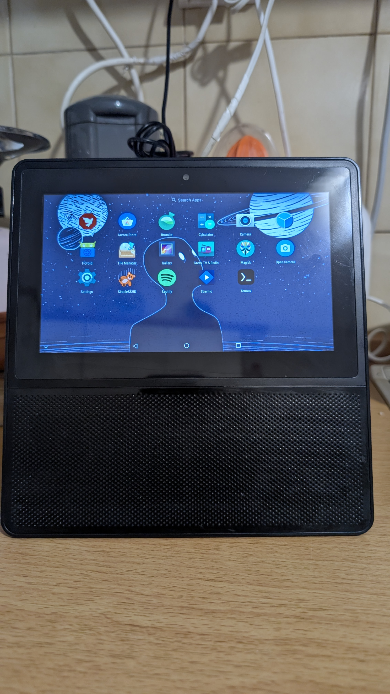
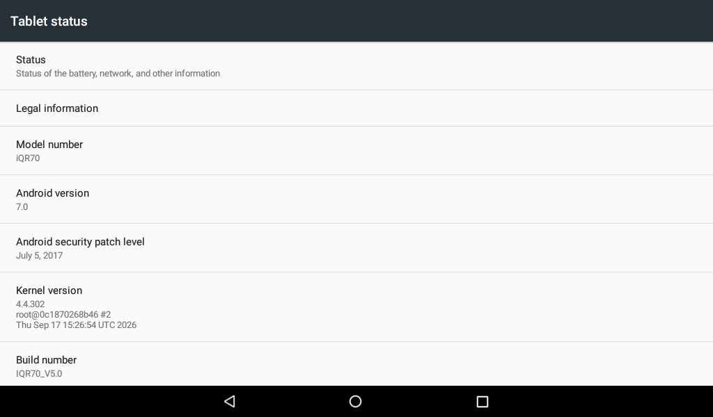
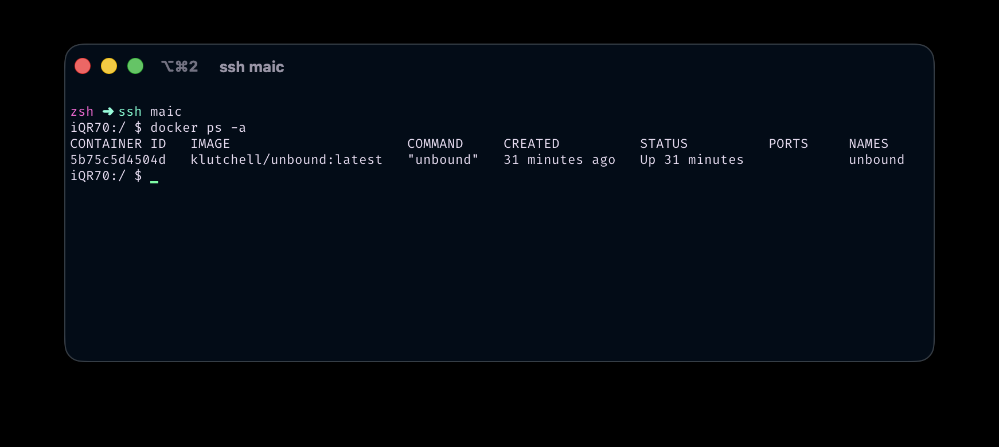

# From locked kiosk to a self-built kernel: reviving the MLS MAIC, end to end

*A discontinued Greek smart display, a frozen Android 7 vendor kernel, and everything it took to make boot flashing reversible so I could actually experiment. Root, drivers written and reverse-engineered, WireGuard, unbound, and two builds that refused to boot.*

I have unfinished business with the MLS MAIC.

It is a small smart display from MLS Innovation, a Greek electronics company that no longer exists. Android 7, a Greek voice assistant behind glass, no updates, no published kernel source, no Google services. Years ago I [found the way out of its kiosk and posted it on XDA](https://xdaforums.com/t/mls-maic-smart-assistant-location-problem-please-help.4499895/#post-88644027), so people could reach the Android underneath. Mine has been the little TV I keep on while I cook ever since. Escaping the kiosk was always step one of a longer project I never finished. This is me finishing it.


*The kitchen TV in question, app drawer open. Magisk, SimpleSSHD, Termux, Greek TV and Radio and the rest, on hardware its maker walked away from.*

Fair warning, this is the long technical version. The short one is the repo: https://github.com/milouk/mls-maic

## Getting in without a cable

Temp root comes from MediaTek's `mtk-su`, Diplomatic's privilege-escalation exploit. It grants root over plain wireless ADB, no A-to-A cable, no BROM:

```sh
adb shell '/data/local/tmp/mtk-su64 -c /system/bin/sh -c "id"'
# → uid=0(root) gid=0(root) ...
```

That one property matters more than it looks. Everything risky I did later leaned on the fact that I could always get root back over Wi-Fi, whatever state the device was in.

## Permanent root, and a hard version ceiling

Root became permanent with a Magisk-patched boot on `mmcblk0p9`. The snag is that this legacy boot depends on the `skip_initramfs` to `want_initramfs` patch, and Magisk removed it in later versions. So there is a ceiling, and it is 25.2. I do not trust that from a changelog, I verify it against the actual image before flashing:

```sh
# both daemon binaries actually embedded and byte-identical to source
magiskboot cpio ramdisk.cpio "exists overlay.d/sbin/magisk64.xz"
# kernel patch actually applied
magiskboot hexpatch kernel 736B69705F696E697472616D6673 ...
# ^ this should find NOTHING. skip_initramfs must be gone. If it patches, STOP.
```

Get it wrong and the device still boots, but `su` is a dead symlink to a zero-byte file. Ask me how I know.

## The certificate trap that cost a day

Every HTTPS stream was failing. The error looked like a bad certificate. It was not:

```
javax.net.ssl.SSLHandshakeException
 Caused by: java.security.cert.CertificateException
 Caused by: java.lang.NullPointerException:
   ...getSubjectX500Principal() on a null object reference
   at android.security.net.config.DirectoryCertificateSource.findCerts
```

Android builds its trust store by walking every file in the cacerts directory. If a single file there cannot be read or parsed, the whole walk returns null and TLS dies for the entire app, even for sites whose CA is perfectly fine. The ROM had never shipped Let's Encrypt's roots, and a stray file with wrong permissions took down the rest. The fix injects the ISRG roots on boot and enforces `0644 root:root` with the correct SELinux context on all 150 certs, every boot.

## The status bar, one byte of resources.arsc

There was no notification shade because MLS had set `status_bar_height` to `0dp` in `framework-res.apk`. SystemUI was drawing the status bar window at zero pixels tall. Patching it to `24dp` changes exactly one byte of `resources.arsc`, then re-signing with the AOSP platform key (the key that actually signed this ROM) so PackageManager still accepts it. Shipped as a Magisk module that replaces an existing file, never one that adds files, which matters for reasons the cacerts trap already taught me.

## Building a kernel, and a four-day black screen

The stock 4.4.22 was a dead end, so I rebuilt from the vendor base. The first four days were a black screen, and the answer was the compiler. A GCC 7.5 build died before the first initcall (`/proc/aed/reboot-reason` showed `last init function 0x0`). Only a GCC 4.9 build, the toolchain the stock kernel was built with, actually boots this tree. The whole build lives in Docker so the toolchain is reproducible and never rots. And there is no UART on this board, no serial header to solder to, so all four of those days were debugged blind, through pstore and the MediaTek reboot-reason record, never a live log.


*The payoff, in Android's own Settings. Kernel 4.4.302 on an iQR70 running Android 7, built by hand.*

## The drivers, where a self-built kernel actually lives or dies

A vendor kernel is not really "source you compile." It is a minefield of board-specific assumptions, and building your own detonates every mine the stock build happened to tiptoe around. Some of this was writing new code, a `__setup` handler here, a 5 KB freestanding recovery binary there. Most of it was reverse-engineering: decompiling the stock drivers, diffing symbol sizes against the stock binary byte for byte, and working out what mine were doing that theirs quietly was not. Almost every fix is one or two tokens, which is exactly what makes driver work equal parts thrilling and humiliating.

### Display: the kernel owned nothing it was drawing

The screen would render correctly and then go green a split second later. To prove the hardware path was fine I turned on `CONFIG_VT` and `FRAMEBUFFER_CONSOLE`, and the kernel drew the Tux logo at framebuffer registration with no userspace involved, then went green anyway. So a known-good configuration was being torn down very early, in kernel context.

The kernel held zero clock references on the display blocks. `MTK_NO_DISP_IN_LK` is undefined, so `dpmgr_path_start()` runs only in decouple mode and is skipped in DIRECT_LINK. `dpmgr_path_init()` is commented out. `disp_probe` does `devm_clk_get` and never `clk_prepare_enable`, so `path_top_clock_on()` is never reached. The display ran entirely on the bootloader's programming, with the kernel holding no references to OVL, RDMA, COLOR, DPI0 or SMI. Then two adjacent `late_initcall`s pulled the rug out. `mtk_smi_init_late()`'s `pm_runtime_put_sync` collapsed the whole DISP power domain, and `clk_disable_unused()` switched off the gates about 291 microseconds later. The fix pins both:

```
clk_ignore_unused smi_keep_disp
```

`clk_ignore_unused` is generic. `smi_keep_disp` is a `__setup()` I added, because the genpd teardown fires earlier and has no generic escape. The honest reframe: stock probably loses the bootloader image too and SurfaceFlinger repairs it within a frame. I was booting the recovery slot, where nothing performs that repair, so the green screen may never have been a regression at all.

### Touch: one return value, and a NAK that was supposed to happen

Dead touchscreen, `Failed to init chip!`. The driver halts the controller's internal DSP by writing `0x88` to register `0xE0`, and the chip NAKs that write on purpose, because it is stopping its own I2C block. Our revision folded that expected `-ENXIO` into the return value:

```c
write_buf[0] = 0x88;
/* Register 0xE0 = 0x88 halts the GSL's internal DSP, and the chip NAKs this
 * write as it stops its own I2C block. Deliberately NOT accumulated into ret. */
gsl_i2c_write_bytes(client, 0xe0, &write_buf[0], 1);   /* was: ret = ... */
```

So `reset_chip()` returned negative, `init_chip()` aborted, `tpd_registration()` bailed, and `request_irq()` and the touch event thread never ran. The chip was healthy the entire time. All 15,213 firmware writes succeeded and `check_mem_data` read `0xb0 == 5a5a5a5a`. A decompile of stock's probe explained why stock never cared: it discards the return value and retries. A second bug hid behind the first, `request_irq` passed `IRQF_TRIGGER_RISING` where the DT declares falling, and a trigger flag in `request_irq` overrides the DT type, so ours won and was wrong. It stayed invisible for days because `GSL_DEBUG` is 0 in this tree, so only the error macro compiled in and every log looked like total failure.

### Camera: a Makefile matched the wrong board

```
CONFIG_ARCH_MTK_PROJECT=tb8167p3_64  ->  findstring tb8167p  ->  -DDEMO_BOARD_SUPPORT=1
```

That single `findstring` forced the legacy-GPIO branch of `kd_camera_hw.c`, whose `mtkcam_gpio_init()` is an empty stub and whose `mtkcam_gpio_set()` drives `cam0_rst` and `cam0_pdn` through GPIO numbers the DT does not provide. Both resolve to -2, `gpio_direction_output` returns `-EINVAL`, reset is never asserted, and no sensor can leave reset. Stock builds the `DEMO_BOARD_SUPPORT==0` branch, which uses the eleven pinctrl states the identical DT already defines. I verified by symbol size, not by hope: `mtkcam_gpio_init` went from 8 bytes to 408, exactly stock's size, and stock-only strings like `Cannot find camera pinctrl` appeared in the image. The sensor itself only captures once the GC5024 MIPI settle count is bumped from 14 to 85, otherwise SENINF times out having read 2452 of 2592 pixels per line.

### Audio: the amp was never bound, and a memset that faulted

Two problems. First, the `2ND EXT Codec` dai_link had `.codec_name = "snd-soc-dummy"`, so `ad82584f_init`, the reset and the 134-register init sequence and the final unmute, never ran. Stock binds `ad82584f.1-0031`. One line. Second, and nastier, the 4.4 AFE path did a plain `memset()` on the DL1 SRAM buffer, which is MMIO. On arm64 `memset` uses the `DC ZVA` cache-zeroing instruction, which faults on device memory. Swapping it for `memset_io()` is what actually let the amp come up cleanly.

### GPU: running an older driver than the userspace calling it

The device's GPU userspace and firmware are DDK `1.8@4490469`. My tree only shipped up to `m1.8ED4333936`, so the kernel-mode driver was older than the userspace calling into it, the dangerous direction, because the PowerVR bridge is unversioned across revisions and an older driver can be missing entry points or disagree on struct layouts. The matching revision turned out to be public in the Acer Iconia B3-A40 tree, also MT8167 on Android 7 and 4.4, and 365 files dropped straight in. The trap was that `gpu_rgx/Makefile`'s version selector is a no-op `ifeq` with both branches hardcoding the same path, so the directory name is the only thing that actually chooses a revision.

### The drivers I deleted, and the one I had to

`sym827`, `nau8540`, `stk8baxx` and `mc3433` were all absent from the stock binary and observably failing to probe, so out they came and the image lost 200 KB. `sym827` was not merely unnecessary, it was actively dangerous. The DT marks it `regulator-always-on` for vproc, so a failing driver is worse than none. It has a latent `regulator_unregister(ERR_PTR)` panic in PID 1. And it `gpio_request`s pin 34, which is a live DPI data line, with no `gpio_free` on any path, while MediaTek's pinctrl physically re-muxes that pin to GPIO mode. Vproc is really fed by the MT6392 PMIC anyway. As a bonus horror, `stk8baxx` calls `sys_fchmodat()` to make its raw I2C sysfs nodes world-writable.

### Knowing when to stop

A full-boot audit at `loglevel=5`, chosen because `console_loglevel` gates what reaches pstore before the per-console loop and so acts as a single capture-volume knob, turned up 68 distinct error shapes. Exactly two were mine, the deliberate touch NAK and some accelerometer-core noise. Both fixed. The other 66 are stock's, and stock ships anyway. That number is what told me the bring-up was done.

## The 4 MiB ceiling, and a bootloop that lied

At one point the device bootlooped and the log blamed SELinux:

```
init: SELinux: Could not open sepolicy: No such file or directory
init: failed to load policy: No such file or directory
init: Security failure, rebooting into recovery mode...
```

The log was wrong. The real cause was DRAM placement. A boot or recovery ramdisk on this device must stay under exactly 4,194,304 bytes compressed, because LK copies each blob to a fixed address and the DTB puts the diagnostic region immediately above it:

```
ram_console-reserved-memory@44400000   0x44400000
budget = 0x44400000 - 0x44000000 = 4 MiB
```

Go over and `ramoops_init` (a `postcore_initcall`) zaps those zones before `populate_rootfs` (a `rootfs_initcall`) ever decompresses the initramfs living there. gzip is a stream, so corruption near the end destroys the tail of the cpio, `/sepolicy` sits about 95 percent in, it vanishes, and init reboots into the same broken image. `mkboot.py` now reads the ceiling from the DTB node names and refuses to pack anything over it.

## The rescue, 5 KB of freestanding C

Here is the piece that made everything else possible. Flashing `p9` used to be a one-way door. A kernel that boots but never reaches usable Android leaves no way back in. So before any risky flash, a tiny freestanding binary in the recovery ramdisk restores a known-good image from `/data`, and it validates before it ever writes:

- No `DO_RESTORE` trigger: it does nothing at all, a normal recovery boot is untouched.
- Image not exactly 16 MiB: refused.
- No `ANDROID!` magic: refused, that is not a boot image.
- Ramdisk blob is `RECOVERY` and not `ROOTFS`: refused, that is a recovery image, not a boot one.

It opens the boot partition for writing only after every check passes, writes, fsyncs, reads back, compares a checksum, and always exits 0 so init never treats it as failed. Verified in anger:

```
maic_rescue: image validated; writing boot partition
maic_rescue: SUCCESS: boot partition restored and verified
```

Why freestanding C and not a script? Stock recovery has no shell, and Magisk's 1.7 MB static busybox does not fit under that 4 MiB ceiling. A raw-syscall binary costs 5 KB.

## The features, once flashing was safe

With a working rescue I stopped being scared of the boot partition, and that is the whole trick. The shipping kernel (`maic-4.4.302`) gained:

- **Camera capture**, from the GC5024 settle fix above.
- **An overclock** that lifts the top operating point from the stock 1.3 GHz to 1.5 GHz, with the interactive governor ranging 598 to 1500 MHz and a thermal throttle that actually lowers the frequency. The vendor code only cut core count, a no-op with hotplug off. Validated over a four-day soak, 85 C peak, zero mismatches.
- **Hardware crypto**, because the A35 does carry the ARMv8 extensions (`aes pmull sha1 sha2` in `/proc/cpuinfo`), so enabling the CE drivers was a real config-only win.
- **The 2024 USB exploit-chain CVE fixes**, CVE-2024-53104, 50302 and 53197, backported and source-gated.
- **WireGuard, in-kernel.** The backport is clean. You drop the compat source into the tree and wire it up:

```sh
ln -sfT "$WG/src" "$K/net/wireguard"
sed -i "/CONFIG_NETFILTER.*+=/a obj-\$(CONFIG_WIREGUARD) += wireguard/" "$K/net/Makefile"
sed -i "/^if INET\$/a source \"net/wireguard/Kconfig\"" "$K/net/Kconfig"
```

This kernel has no loadable-module support, so it builds in as `=y`. 116 `wg_` symbols end up in the image, and `ip link add wg0 type wireguard` just works.

- **Real Docker on Android 7.** The kernel gained overlayfs and the missing cgroup and namespace controllers, then three host workarounds got it running. My favorite is `/run`. The rootfs is read-only and non-remountable and `/run` does not exist, and dockerd 25.x hardcodes `/run/docker/plugins`, so I give it a writable `/run` inside its own private mount namespace where the real system never sees it:

```sh
unshare -m sh -c '
  busybox mount -o remount,rw /
  mkdir -p /run
  busybox mount -o remount,ro /
  mount -t tmpfs tmpfs /run
  ... exec dockerd
'
```

The first thing I put in a container was unbound, a full recursive DNS resolver, so the tablet answers its own lookups from the root servers down instead of trusting whatever DNS the network hands it. WireGuard is the headline act, the reason the kernel work was worth it, but a private recursive resolver humming along next to it on a 2 GB kitchen display is the kind of absurd that makes me grin every time I remember it is running.


*Real Docker on Android 7, seen over SSH from my Mac. `docker ps` shows the unbound recursive resolver up.*

- **Filesystems**, exFAT, NTFS, ext4 and f2fs, all built in, so any USB stick just mounts.

## The two builds that refused to boot

Not everything worked. Two hardening builds turned on `DEBUG_RODATA` and software PAN, and they would not boot at all:

```
< # CONFIG_ARM64_SW_TTBR0_PAN is not set
> CONFIG_ARM64_SW_TTBR0_PAN=y
< # CONFIG_DEBUG_RODATA is not set
> CONFIG_DEBUG_RODATA=y
```

The A35 is ARMv8.0, so hardware PAN is a no-op and software PAN becomes the real enforcement. MediaTek's vendor drivers dereference user pointers directly, so it faults in early boot. On most projects that is a dead device. Here the rescue caught it twice and restored stock on its own. The shipping kernel keeps the crypto and the CVE fixes and drops those two options. I never touched a cable, and the kitchen never noticed.

## Where it landed

A discontinued smart display, first pried open years ago on XDA, is now a rooted and hardened tablet that streams TV, terminates a WireGuard tunnel, resolves its own DNS through unbound, and runs Docker containers, all on a frozen vendor kernel I dragged forward by hand, driver by driver.

And here is the part I am quietly smug about. Not one cable was involved in any of it. Rooting, every kernel flash, both rescues, all of it happened over Wi-Fi from a terminal on my Mac. No UART, no USB, no BROM. The device never once left the kitchen counter.

None of it was necessary. That is exactly why it was worth doing.

Everything is here: https://github.com/milouk/mls-maic
